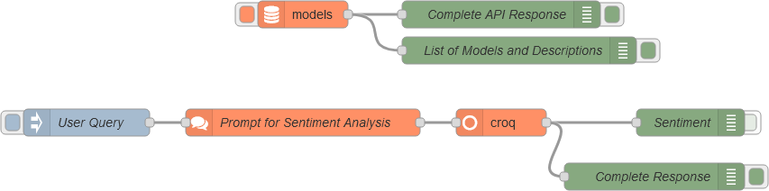

# node-red-contrib-croq-api

A Node-RED node for interacting with the **Groq API**.  
Currently, it supports only synchronous API calls.

## Features

- Easily interact with the Groq API for chat-based completions.
- Customize the model, temperature, and token limits.
- Requires an API key: Get yours from [GroqCloud Console](https://console.groq.com/keys).
- Lightweight implementation using Node.js's native `https` module.

## Installation

Install the nodes directly through Node-RED's built-in palette manager.

## Nodes

- **croq**: Calls the API.
- **prompt**: Helps construct the prompt.
- **models**: Retrieves available models.

## Usage

1. Drag the **croq** node from the palette into your Node-RED workspace.
2. Double-click the node to open the configuration panel:
   - Enter your **Groq API Key**. If you don’t have one, visit the [GroqCloud Console](https://console.groq.com/keys) to generate it. You will need to create a Groq account. Usage is **restricted** but **free** within defined limits. 
   - Specify a model in the node or in the input payload, e.g., **llama3-8b-8192**.
   - Optionally set values for temperature and maximum tokens.
3. Use the **model** node to retrieve a list of available models.
4. Use the **prompt** node to configure a multi-part structured prompt and pass it to the **croq** node as `msg.prompt`.
5. The **croq** node returns the API response in `msg.payload`.

## Example Flow
The example flow demonstrates how to use the nodes together:

You can import it from the repository to get started quickly.